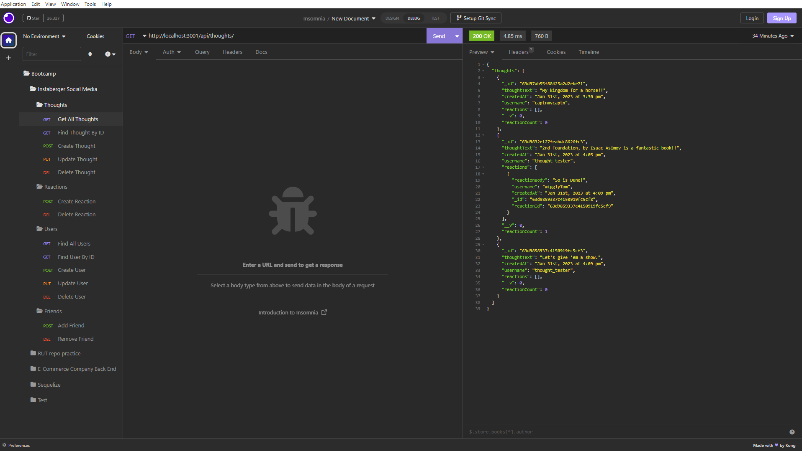

# Instaberger Social Network

## Description

It's **Instaberger**, a social network back end using Mongoose!  This was my introduction to MongoDB.  While challenging at first, by the end I really had a handle on this database technology.  The syntax can be a little challenging at first, but the basic logic of what is happening is clear, which makes it somewhat easier to understand once you figure out how all the pieces work together.  WHile this is only a back end build, it's really nice to see all the pieces coming together to be able to build something substantial.  If this doesn't help anyone else  in the future, it certainly was a help to me!!

## Table of Contents

- [Installation](#installation)
- [Usage](#usage)
- [Credits](#credits)
- [License](#license)

## Installation

Once the files are all locally on a system, it will require node modules in order to function.  The package.json gives a guide for what will be installed.  All that the user needs to type is npm install to install the encessary modules.  It also requires a program like Insomnia to interact with it because there is no user-interface.

## Usage

This is a back end build only.  There is no front end to interact with as a user, so in order to use this application, it will need to be run locally using a program like Insomnia. Once the node moduels needed are installed, press npm start to open the server on a port.  Then move over to Insomnia to interact with the program.  See the tutorial video below for a reference on how to use Insomnia to send requests to the back end.

)

## Credits

**Special Thanks** to Paul Cwik for providing the dateFormat.js helper file.

Additional thanks to the Web Dev Simplified for their youtube videos.

Link: [Web Dev Simplified](https://www.youtube.com/@WebDevSimplified 'The Youtube channel for Web Dev Simplified.')

## License

  This application is covered by the MIT license. 
  (https://opensource.org/licenses/MIT)